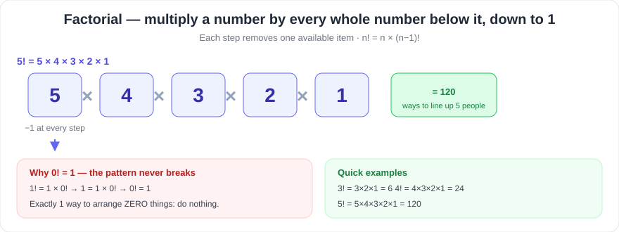
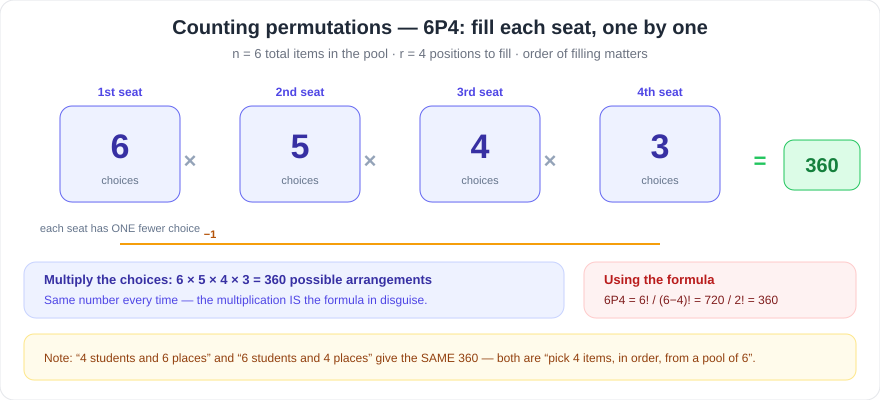
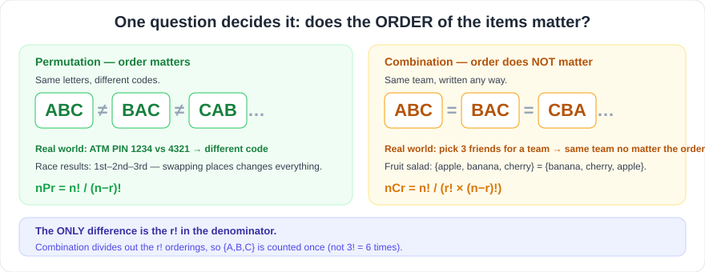
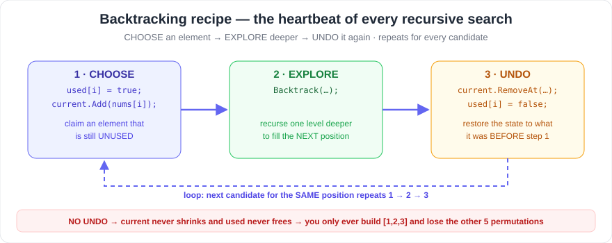
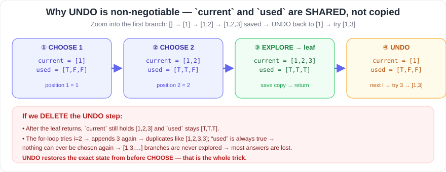
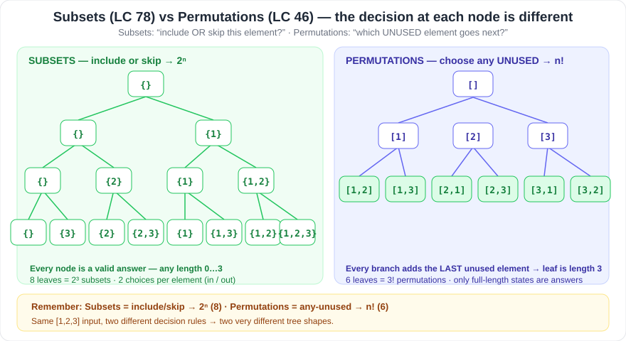

# Permutations & Backtracking — Study Notes

> Beginner-friendly notes for **LeetCode / interview** prep.
> Core pattern: **Backtracking** (`CHOOSE → EXPLORE → UNDO`).
> Anchor problems: **LeetCode 46 – Permutations** and **LeetCode 78 – Subsets**.
> Code samples: **C#**.

---

## Table of Contents

1. [Factorial](#1-factorial)
2. [Permutation](#2-permutation)
3. [6 Students and 4 Places](#3-6-students-and-4-places)
4. [Permutation vs Combination](#4-difference-between-permutation-and-combination)
5. [Why Permutations Appear in Backtracking](#5-why-permutations-appear-in-backtracking)
6. [The Backtracking Pattern](#6-backtracking-pattern)
7. [Subsets vs Permutations](#7-subsets-vs-permutations)
8. [LeetCode 46 – Permutations (full solution)](#8-leetcode-46---permutations)
9. [Recursion tree for `[1,2,3]`](#9-recursion-tree-for-123)
10. [Complexity](#10-complexity)
11. [Interview cheat sheet](#11-important-mental-model)

---

## 1. Factorial

**What it means:** the factorial of a number `n` is *"multiply `n` by every whole number below it, down to 1"*. It answers the question *"how many ways can `n` things be arranged in a line?"*

```text
n! = n × (n-1) × (n-2) × ... × 3 × 2 × 1
```

It always steps down by 1 every time — **order matters** and each step removes one available item.

| Example | Multiplication | Result |
| ------- | -------------- | ------ |
| `3!`    | `3 × 2 × 1`    | **6**   |
| `4!`    | `4 × 3 × 2 × 1`| **24**  |
| `5!`    | `5 × 4 × 3 × 2 × 1` | **120** |



### Why is `0! = 1`?

The factorial pattern must stay consistent going *backwards* too:

```text
1! = 1 × 0!
```

We know `1! = 1`, so:

```text
1 = 1 × 0!   ⟹   0! = 1
```

**Intuition:** there is exactly **1 way** to arrange zero things (do nothing). `0! = 1` also keeps the permutation formulas working (see Section 2).

**Key identity used everywhere:**

```text
n! = n × (n-1)!
```

> Example: `6! = 6 × 5!` and `5! = 5 × 4!` — the factorial is just the previous factorial times the current number.

---

## 2. Permutation

**Definition:** a permutation is an **arrangement** of items where **order matters**.

- `ABC` and `BAC` use the same letters, but they are **different** permutations.
- Examples: PIN codes (`123` ≠ `321`), passwords, race results (1st, 2nd, 3rd), seat assignments.

**Formula:**

```text
nPr = n! / (n-r)!
```

**Every variable explained:**

| Variable | Meaning |
| -------- | ------- |
| `n`      | **total number of available items** (the pool you pick from) |
| `r`      | **number of positions / items being arranged** (how many you actually place) |
| `nPr`    | number of ways to pick `r` items **from** `n` *and put them in order* |

**Simple example — 4 students and 6 places:**

You have 4 students who must sit in 6 available seats. Fill the seats one by one:

- **6** choices for the **first** student (any of the 6 seats)
- **5** choices for the **second** student (1 seat is taken)
- **4** choices for the **third** student (2 seats are taken)
- **3** choices for the **fourth** student (3 seats are taken)

```text
6 × 5 × 4 × 3 = 360
```

Using the formula:

```text
6P4 = 6! / (6-4)! = 6! / 2! = 720 / 2 = 360
```

> **Why the formula works:** `6! = 720` arranges **all 6** seats. We only need the first **4** positions — so we divide away (`/ 2!`) the arrangements of the **last 2** unused seats. Same answer, faster to write.



---

## 3. 6 Students and 4 Places

Flip the earlier example around — now:

- **Students = 6**, **Places = 4**
- Only **4 of the 6 students** can occupy the 4 places
- A group of **4 places** is chosen from **6 students**, and the *order of who sits where matters*

Whatever direction you look at it, the calculation is identical because both reduce to the same question:

> **"Arrange any 4 items taken from a pool of 6, in order."**

```text
6P4 = 6! / (6-4)! = 6! / 2! = 360
```

The multiplication is the same:

```text
6 × 5 × 4 × 3 = 360
```

**This is why the two examples are the same calculation:**

| Scenario | What you really pick | Count |
| -------- | -------------------- | ----- |
| **4 students, 6 places** | 4 seats chosen from 6 → assigned to 4 students | `6 × 5 × 4 × 3 = 360` |
| **6 students, 4 places** | 4 seats filled from 6 students | `6 × 5 × 4 × 3 = 360` |

Both are "**arrangements of 4 positions chosen from 6 possible items**" → `6P4 = 360`. The labels (student/place) don't change the math — what matters is: **we pick 4, in order, from 6.**

---

## 4. Difference Between Permutation and Combination

The **one** question that separates them:

> **Does the order of the chosen items matter?**

### Permutation — order matters

```text
ABC and BAC are DIFFERENT
```

- Used when the sequence has meaning: passwords, PINs, race positions, seating.

### Combination — order does not matter

```text
ABC and BAC are the SAME selection
```

- Used when you only care *which* items you got: teams, fruits in a salad, lottery numbers.

**Formulas:**

```text
Permutation:  nPr = n! / (n-r)!
Combination:  nCr = n! / (r! × (n-r)!)
```

**The only difference is the `r!` in the denominator.** Permutation counts every ordering of the same `r` items as separate; combination divides by `r!` so `{A,B,C}` is counted once instead of `6` times (`3! = 6` possible orders).

**Real-world examples:**

| Situation | Permutation or Combination? | Why |
| --------- | --------------------------- | --- |
| 4-digit ATM PIN `1234` vs `4321` | **Permutation** | rearranging digits creates a different code |
| Pick 3 friends from 8 for a team | **Combination** | the committee is the same regardless of listing order |



---

## 5. Why Permutations Appear in Backtracking

Generating all permutations is a **search over all orderings** — and backtracking explores every branch of a decision tree.

The rule at every step:

> At every level of recursion, we can choose **any unused element** from the input.

Example:

```text
nums = [1, 2, 3]
```

Recursion conceptually (each level picks **one more** unused number):

```text
                []
          /      |      \
         1       2       3
       /  \     / \     / \
     1,2  1,3 2,1 2,3 3,1 3,2
      |    |    |   |    |   |
    1,2,3 1,3,2 2,1,3 2,3,1 3,1,2 3,2,1
```

Total number of permutations of `3` items = **`3! = 6`**.

All six permutations:

```text
123
132
213
231
312
321
```

> **Pattern to spot:** at the first level there are `3` choices, then `2`, then `1` → `3 × 2 × 1 = 6`. That's exactly `n!` — the tree has **n! leaf nodes**.

![Recursion tree for [1,2,3]](../public/images/bt-permutations-tree.svg)

---

## 6. Backtracking Pattern

Backtracking = **DFS over a decision tree with undo**. Every path you go down, you must be able to *walk back* cleanly.

The three fundamental steps:

```text
CHOOSE
   ↓
EXPLORE
   ↓
UNDO
```

**Generic C# template:**

```csharp
void Backtrack(...)
{
    if (condition)
    {
        // add answer
        return;
    }

    for (...)
    {
        // CHOOSE

        // EXPLORE
        Backtrack(...);

        // UNDO
    }
}
```

**Why the `UNDO` step is necessary:**

- The `current` list is **shared** between all branches of recursion, not copied.
- If you never remove the element you just added, the next `for` iteration starts with a polluted list (`[1,2]` becomes `[1,2,3]` instead of `[1,3]`).
- Same for `used`: if you never mark it free again, elements can never be reused by a sibling branch.
- In short: **you only get a correct branch if you restore the state exactly as it was before CHOOSE.** Without UNDO you would find just one permutation (or wrong ones) instead of all `n!` of them.





---

## 7. Subsets vs Permutations

Two of the most common backtracking problems teach the contrast: **LeetCode 78 (Subsets)** vs **LeetCode 46 (Permutations)**.

### Subsets (LeetCode 78)

- At each element, you **choose whether to include it** (take it or leave it).
- **Every current state can be an answer** (`[]`, `[1]`, `[1,3]` … are all valid subsets).
- Number of subsets = **`2^n`**.

### Permutations (LeetCode 46)

- You must **arrange all elements** — every answer has length `n`.
- At each level, **choose an *unused* element**.
- Number of permutations = **`n!`**.

### Demonstrated with `[1,2,3]`

| | Subsets (LC 78) | Permutations (LC 46) |
| --- | --- | --- |
| Decision at each step | *include or skip* the element | *pick any unused* element |
| Valid answers | **8** (`2³`) | **6** (`3!`) |
| Allowed lengths | any length `0…3` | only length `3` |
| Examples | `[]`, `[1]`, `[2,3]`, `[1,2,3]` | `[1,2,3]`, `[3,1,2]`, … |



> **Interview line:** "Subsets is a *take-it-or-leave-it* tree → `2^n`; permutations is a *choose-any-unused* tree → `n!`."

---

## 8. LeetCode 46 - Permutations

**Problem (in one line):** given an array `nums` of **distinct** integers, return **all possible permutations** — every ordering of every element.

**Beginner-friendly C# solution:**

```csharp
public class Solution
{
    private List<IList<int>> result = new();

    public IList<IList<int>> Permute(int[] nums)
    {
        Backtrack(nums, new List<int>(), new bool[nums.Length]);
        return result;
    }

    private void Backtrack(
        int[] nums,
        List<int> current,
        bool[] used)
    {
        if (current.Count == nums.Length)
        {
            result.Add(new List<int>(current));
            return;
        }

        for (int i = 0; i < nums.Length; i++)
        {
            if (used[i])
                continue;

            // CHOOSE
            used[i] = true;
            current.Add(nums[i]);

            // EXPLORE
            Backtrack(nums, current, used);

            // UNDO
            current.RemoveAt(current.Count - 1);
            used[i] = false;
        }
    }
}
```

### Line-by-line explanation

**Storage & entry point**

```csharp
private List<IList<int>> result = new();
```

A class-level bag where every **complete** permutation is stored.

```csharp
Backtrack(nums, new List<int>(), new bool[nums.Length]);
```

Start the search with an **empty** `current` list and an all-`false` `used` array (nothing placed yet).

**Base case — a permutation is complete**

```csharp
if (current.Count == nums.Length)
{
    result.Add(new List<int>(current));
    return;
}
```

`current` has filled every position, so we save it. We store `new List<int>(current)` — a **copy** — because UNDO later mutates `current`; without the copy, every saved answer would silently become the same final list.

**The loop — try every candidate for this position**

```csharp
for (int i = 0; i < nums.Length; i++)
{
    if (used[i])
        continue;
```

Loop over every index, skipping elements already used earlier in this path.

**CHOOSE → EXPLORE → UNDO — the heart of the pattern**

```csharp
// CHOOSE
used[i] = true;
current.Add(nums[i]);

// EXPLORE
Backtrack(nums, current, used);

// UNDO
current.RemoveAt(current.Count - 1);
used[i] = false;
```

| Step | Lines | What physically changes |
| ---- | ----- | ----------------------- |
| **CHOOSE** | `used[i] = true;` then `current.Add(nums[i]);` | Claim element `i` and append it to the partial permutation. |
| **EXPLORE** | `Backtrack(nums, current, used);` | Descend one level — `current` now has one more element; fill the **next** position. When it returns, every deeper branch is done. |
| **UNDO** | `current.RemoveAt(current.Count - 1);` then `used[i] = false;` | Remove the last element and unclaim index `i`, restoring the exact state from before CHOOSE so the next `i` can be tried. |

> **Memorize these four lines in this order.** Every permutation / combination / subsets DFS uses the same CHOOSE → EXPLORE → UNDO structure around the recursive call.

---

## 9. Recursion Tree for [1,2,3]

Each **level of the tree = one position in the permutation** (slot 1, slot 2, slot 3).

```text
                    []
             /       |       \
            1        2        3
          /   \     / \      / \
        1,2  1,3  2,1 2,3  3,1 3,2
         |    |     |   |    |   |
       123  132   213 231  312 321
```

- **Level 0 (root):** no position filled yet — `[]`.
- **Level 1:** pick a value for position #1 → `[1]`, `[2]`, or `[3]`.
- **Level 2:** pick a value for position #2 among the *remaining* ones → `[1,2]`, `[1,3]`, …
- **Level 3 (leaves):** position #3 gets the **last unused** value → complete permutation saved as an answer.
- Depth = `n = 3`, branching shrinks `3 → 2 → 1`, so leaves = `3 × 2 × 1 = 3! = 6`.

> Following the highlighted path in the tree diagram is exactly the depth-first order the code visits: `[] → [1] → [1,2] → [1,2,3]` (save) → back to `[1]` → `[1,3] → [1,3,2]` (save) → back → `[]`, then repeat for `[2,…]` and `[3,…]`.

![Recursion tree for [1,2,3]](../public/images/bt-permutations-tree.svg)

---

## 10. Complexity

| Resource | Cost | Why |
| -------- | ---- | --- |
| Number of permutations | `n!` | every ordering of all `n` elements |
| Work to copy each permutation into `result` | `O(n)` | each answer has `n` elements |
| **Time complexity** | **`O(n × n!)`** | `n!` permutations × `O(n)` work each |
| Recursion depth (call stack) | `O(n)` | one recursive frame per position |
| `current` list + `used` array | `O(n)` | temporary scratch space |
| Result storage | `O(n × n!)` | `n!` lists, each of length `n` |

Interpretation:

- **Time:** `n!` leaves exist, and building/saving each leaf costs `O(n)` → total ≈ `O(n · n!)`.
- **Auxiliary space (excluding the answer):** the deepest recursion uses one `current` and one `used` — both length `n` → `O(n)`. (The `n` frames on the stack are `O(n)` too.)
- **Output space:** mandatory — the problem asks you to *return* all `n!` permutations → `O(n × n!)`.

> **Interview note:** for `n = 10`, `10! = 3,628,800` permutations — this pattern only fits problems with small `n` (usually `n ≤ 8–10`).

---

## 11. Important Mental Model

**Interview cheat sheet — memorize this:**

```text
Factorial:
n! = n × (n-1)!
0! = 1

Permutation:
nPr = n! / (n-r)!

Combination:
nCr = n! / (r!(n-r)!)

Subsets:
2^n          (include/exclude each element)

Permutations:
n!           (arrange all elements, any unused at each step)

Backtracking:
CHOOSE → EXPLORE → UNDO
```

**How to think during an interview (not just formulas):**

1. **See a "generate all orderings/arrangements" prompt?** That’s permutations → `n!`, backtracking with a `used[]` array.
2. **See a "generate all subsets/combinations" prompt?** That’s inclusion/exclusion → `2^n` or `nCr`, backtracking with a `start` index.
3. Every backtracking solution = **choose → explore → undo** inside a recursive `for` loop, with a base case that saves the answer.
4. **Order of results doesn’t matter** to LeetCode — it only matters that you produce every answer exactly once.
5. The whole trick is the **UNDO step**: shared state must return to exactly what it was before the CHOOSE, or branches contaminate each other.